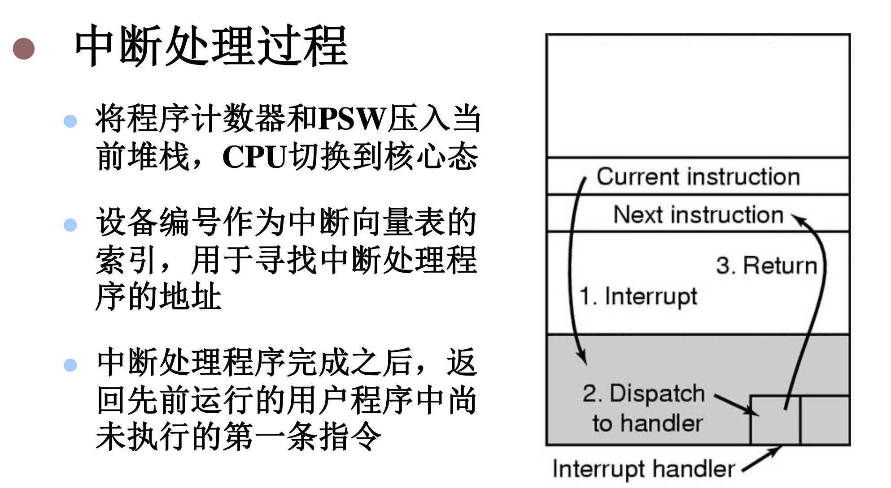
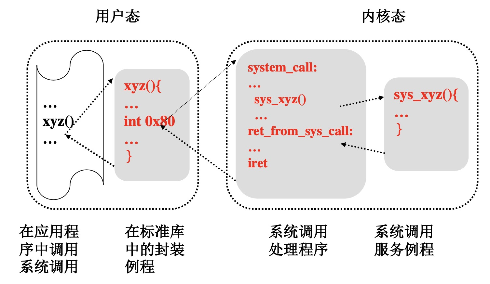
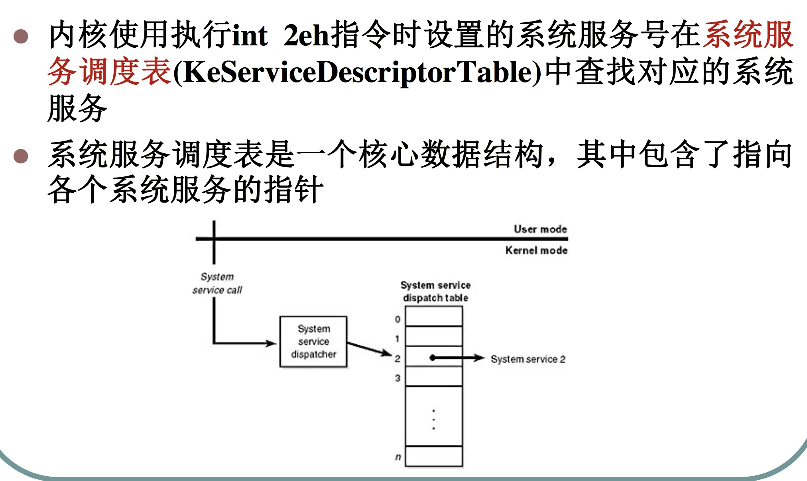
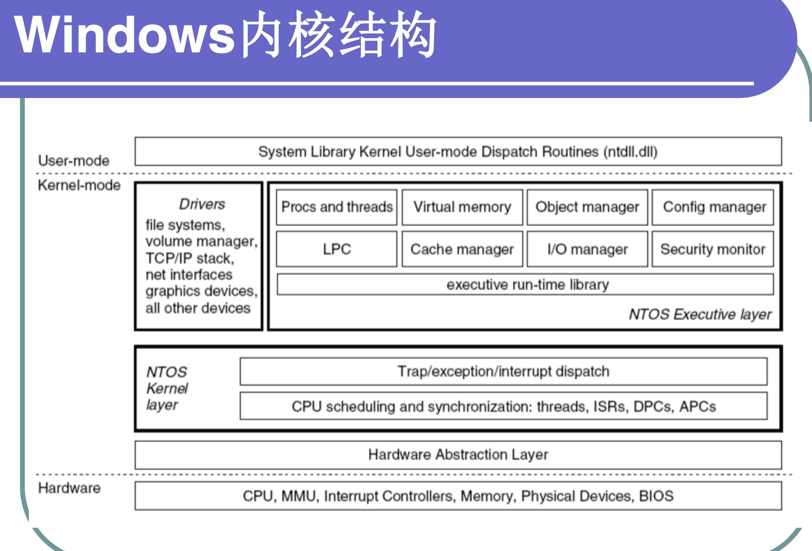
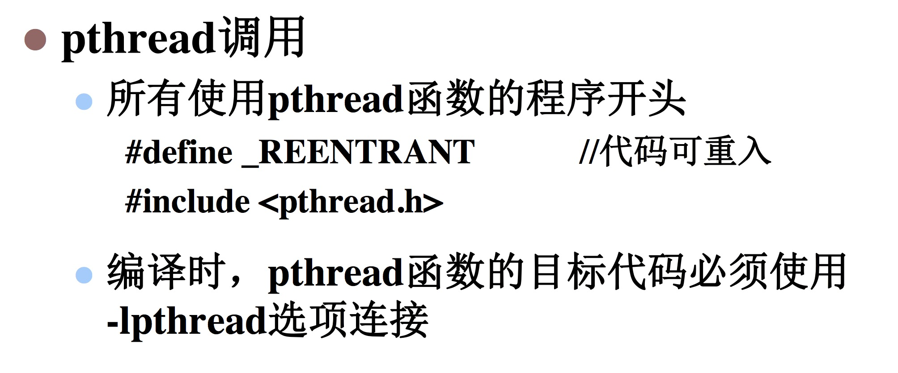

## 操作系统（本科课程笔记）
[toc]
书1：现代操作系统，答案 http://www.docin.com/p-1064801733.html?docfrom=rrela
### chpt1 引论
工作原理和实现方法

技术含量最高的系统软件


将硬件的复杂性与程序员分离开

定义：系统软件， 程序模块的集合，资源管理和用户接口功能

作用：
1. 作为扩展机器
* 裸机添加
* 理解“抽象”，如文件
2. 作为资源管理者／作业管理（大型机）
* 多路复用，时间与空间
3. 软硬件接口
* system call

#### 1.发展史

1. 批处理操作系统

	改进主存和I/O设备之间的吞吐量
	
	特征：用户脱机使用，无法交互

2. 多道程序设计 multiprogramming
	需要硬件保护
	
	宏观上并行，微观上串行
3. 系列机思想与IBM System/360系统
	统一的体系结构、指令集 -> 软件危机
4. 分时系统：轮流使用time slice
	unix操作系统：多用户、多任务、分时
	unic前身是MULTICS系统，内外环设计
5. 大规模集成电路时代
	分布式、嵌入式

#### 2.操作系统的硬件环境

**寄存器分类：**
- 用户可见寄存器: 高级语言编译器通过算法分配并使用之，以减少程序访问主存次数

  数据寄存器、地址寄存器、条件码寄存器（溢出、符号）

- 控制和状态寄存器: 用于控制处理器的操作，由OS的特权代码使用, 以控制其他程序的执行

  PC、IR、PSW(program status word)
  
  PSW中有一位CPU的状态工作码, PSW在系统调用和I/O中很重要

**核心态=管态、用户态=目态**

* I/O不在用户态内
* 用户态->核心态: trap	核心态->用户态：修改PSW<br/>

e.g. x86: R0 R1 R2 R3<br/>

**层次化存储体系结构** ～ 容量、速度、成本<br/>

存储访问局部性原理<br/>
cpu访问寄存器不存在延时，操作系统不访问cache<br/>
磁带光盘价格极其低廉，作为磁盘的备份<br/>

shell 、GUI<br/>
多线程和多核芯片 书1p13<br/>

I/O：控制器+设备本身    device driver<br/>

* 实现I/O的三种方式<br/>
轮询、中断、DMA芯片（总线竞争、大量I/O数据传送）

中断系统的两大组成部分: 硬件中断装置和软件中断处理程序 (中断设备的设备驱动程序的一部分)

中断向量    中断向量表IVT



启动计算机：主板BIOS<br/>
进程、地址空间、进程间通信<br/>
虚拟内存<br/>
UNIX：特殊文件、管道<br/>
rwx r-x --x     p25<br/>
<br/>
**“个体重复系统发育”**，很深刻<br/>

#### 3.系统调用

1.6 系统调用~执行“trap”			功能号和参数<br/>
大多采用在内存中开辟专用堆栈区来传递参数<br/>

**linux系统调用**： <br/>
system_call() 	sys_call_table<br/>

> Linux系统调用利用了x86体系结构中的软件中断，即调用了int $0x80汇编指令。这条汇编指令将产生向量为128的软件中断， CPU被切换到内核态，并将控制权交给系统调用过程的起点system_call()处理函数

系统调用与内核函数（即服务例程，e.g. sys_getpid()）<br/>
封装例程     ppt2-p56<br/>



用于进程管理、文件管理、目录管理         书1p32<br/>
UID、GID、PID<br/>
PID～fork，waitpid指令<br/>
fork不可继承的有:进程标识符，父进程标识符<br/>
[execve](https://my.oschina.net/u/3857782/blog/1854572)：替换一个进程的核心映像<br/>

**POSIX过程调用** ：进程管理(fork, execve, waitpid, exit(status) )、文件管理(open, ...)、目录管理（mkdir, rmdir, ..., umount, unlink）、其它([chmod](https://blog.csdn.net/pythonw/article/details/80263428), kill, chdir, time)

<-> 

WIN32 API: <br/>


#### 4.操作系统结构
* 单体系统（模块组合结构）
* 层次式系统

分层：全序、偏序、半序<br/>
* 微内核
* 虚拟机结构: VM/370

会话监控系统CMS<br/>

这是1型超级监控程序（cons：用户态不能陷入）<br/>

2型：VMWare，主机/客户操作系统<br/>

* 微内核结构：运行在核心态的内核􏰁提供最基本的操作系统功能，包括中断处理、处理机调度、进程间通信。这些部分只􏰁供了一个很小的功能集合，通常称为微内核<br/><br/>

特点：Mechanism和policy分离=>使内核更小<br/>

微内核结构的变体：客户-服务器模型<br/>

客户进程与服务器进程之间使用消息进行通信<br/>



### chpt2 进程与线程

#### 1.进程

顺序进程模型

* 有时须考虑严格的实时要求

并发：次序不是事先确定的

**进程**是具有独立功能的程序在某个数据集合上的一次运行活动，是系统进行资源分配和调度的独立单位

* 资源分组处理与执行
* 进程的组成:程序+数据+PCB进程控制块+堆栈

NOTE：

* 守护进程daemon
* windows没有进程层次的概念 书p51
* shell p26

调度进程： 进程表=PCB表 p53
* 并发度：PCB表的大小
* 链表结构、索引结构
* 多道（内存层面）!=系统并发度（OS层面）


* windows进程无状态，只是宿主，真正运行的是线程（调度单位）
* UNIX中，OS作为进程的一部分

##### e.g. Linux进程控制块
* struct task_struct	双向循环链表
* 调度针对就绪进程	run_list


##### 进程的状态

* 运行->阻塞：OS、I/O、资源、IPC（其它进程输入）
* 运行->就绪：时间片用完、因为高优先级进程就绪而中断
* 就绪->运行：调度程序
* 阻塞->就绪

其它：
* initial和final（五状态）：
  * initial态：等待资源；
  * final态（在UNIX称作zombie state）和return 0联系，parent进程 wait()子进程
  * 表格和其它信息暂时由辅助程序保留，例如为处理用户帐单而累计资源使用情况的财务
程序
* suspend（挂起）状态（七状态）：进程映像在磁盘上，不占用内存空间
* 激活的概念：阻塞挂起->阻塞, 就绪挂起->就绪


#### 2.进程控制

* 进程控制原语：创建、撤销、阻塞、唤醒
  * 系统调用不一定是原语：两进程，read()重入

##### e.g. POSIX进程控制
* 创建进程
  * fork——创建新进程，复制现有进程上下文
  * exec——加载新程序并覆盖自身
* 可继承(inherit):子进程可以从父进程中继承用户标识符、环境变量、打开文件、 文件系统的当前目录、控制终端、已经连接的共享存储区、信号处理例程入口表等
* 不可继承:进程标识符，父进程标识符
* exit：exit()向父进程给出一个退出码(8位的整数)，父进程终止时如何影响子进程:
  * 子进程从父进程继承了进程组ID和终端组ID(控制终端)，因此子进程对发给该进程组或终端组的信号敏感。终端关闭时，以该终端为控制终端的所有进程都收到SIGHUP信号。
  * 子进程终止时，向父进程发送SIGCHLD信号，父进 程截获此信号并通过wait()系统调用来释放子进程PCB
* wait() waitpid() waitid()等待子进程修改状态

##### e.g. Linux进程控制

```c++
#include <cstdlib>
#include <iostream>
#include <sys/types.h>
#include<sys/wait.h>
#include <unistd.h>
#include <vector>
using namespace std;

int main(){
    int pid;
    for (int i = 0; i < 3; i++){
        pid = fork();
        if (pid == 0){ //子进程
            cout << "pid=" << pid << getpid() << ", hello world" << endl;
            return 0;
        }
        else{
            cout << "pid=" << pid << " forked" << endl;
        }
    }
    int ret = 0;
    while (ret!=-1){
        ret = wait(NULL);
        cout << "pid=" << ret << " exited" << endl;
    };
    return 0;
}
```

##### e.g. Windows进程控制
```c++
/*
BOOL CreateProcess(
LPCWSTR pszImageName, LPCWSTR pszCmdLine, LPSECURITY_ATTRIBUTES psaProcess, LPSECURITY_ATTRIBUTES psaThread, BOOL fInheritHandles,
DWORD fdwCreate, LPVOID pvEnvironment, LPWSTR pszCurDir,
LPSTARTUPINFOW psiStartInfo, LPPROCESS_INFORMATION pProcInfo
);
*/
#include <stdio.h> 
#include <windows.h>
int main() {
	TCHAR szCmdLine[]={TEXT("C:\\oscourse\\test.exe")}; 
	STARTUPINFO si;
	PROCESS_INFORMATION pi;
	memset(&si, 0, sizeof(STARTUPINFO));
	si.cb = sizeof(STARTUPINFO); 
  si.dwFlags = STARTF_USESHOWWINDOW; 
  si.wShowWindow = SW_SHOW;
  if(!CreateProcess(NULL, szCmdLine, NULL, NULL, FALSE, 0, NULL, NULL, &si, &pi))
	{
		printf("Create process fail!\n");
		ExitProcess(1);
	} 
  else {
    printf("Create process success!\n"); 
    ExitProcess(0);
	} 
}
```


#### 3.线程模型
进程是资源分配单位	～ 并发执行
  * 1-p^n     内存与吞吐量

线程是CPU调度单位  ～  时空开销
  * 多线程Multithreading


  * 线程：并行实体共享同一地址空间和所有可用数据，线程比进程更容易创建和撤销
  * 轻量级进程=Lightweight process=LWP
  * TCB与PCB
  * e.g. 书p56 三线程、文字处理
  * 在支持线程的操作系统中，进程只作为资源分配单位，而线程则作为CPU调度单位，可读取全局变量来实现通信，比进程间通信简单不少，无需调用内核

NOTE：

* 服务器与cache，分派线程、工作线程，c代码
* 线程改善了web服务器的性能
* 有限状态机实现，非阻塞系统调用<->顺序进程模型的保留 书p57
* [“阻塞非阻塞"与"同步异步”](
  https://www.cnblogs.com/skying555/p/5028167.html): 线程可以异步，因为有状态共享；同步是两个对象之间的关系，而阻塞是一个对象的状态。

#### 4.线程的实现机制

在用户空间／内核中实现线程

##### 用户级线程（ULT）
* 线程库（运行时系统）：POSIX的pthread

	阻塞系统问题、缺页中断问题
    run-time system
    线程没有时间中断=>只能用非抢占式
     当线程调用系统调用(阻塞式)时，整个进程阻塞
    不可轮转调度

内核实现：
    线程管理代价大
    时间片分配给线程，所以多线程的进程获得更 多CPU时间
混合实现 solaris
    ULTyingshedao

调度程序激活机制：上行调用


pthread_yield

2.3 进程间通信

进程间关系：互斥、同步、通信

spooler directory p67
    race condition 竞争条件
临界区    临界资源

进入区、临界区、退出区、剩余区

忙等待的互斥
    屏蔽中断
    锁变量    <-> Murphy’s law    
    严格轮换法：忙等待、自旋锁
    Peterson解法：丢失则进入临界区
    TSL指令：硬件支持 p73详细解释该命令 test and set lock
    
睡眠与唤醒
    原语 sleep wakeup

    dijkstra:信号量、原子操作    
    s.count     s.queue
    成对使用P、V原语
        同步P操作在互斥P操作前

管程
    规定唤醒是最后操作
    入口等待队列、紧急等待队列

* 与互斥锁不同，条件变量是用来等待而不是用来上锁的

条件变量
    wait signal
https://www.cnblogs.com/qiangxia/p/4293088.html

mutex互斥锁,适用于用户级线程包
快速用户区互斥量futex p76


有名信号量、基于内存的无名信号量
    有名：保存在文件中，sem_open代替sem_init，共享sem_wait sem_post

BSD则跳过了该限制，形成了基于套接字(Socket)的进程间通信机制


2.3.8 消息传递            
消息传递接口MPI    “会合”的概念
屏障barrier：
    e.g. 大型矩阵运算的分治
避免锁：读-复制-更新    RCU


2.4 调度    
    处理机调度

非抢先式／抢先式（时间片、中断）

I/O活动的含义：阻塞 p85
I/O密集型～多道程序设计
批处理／交互式／实时

系统需要“平衡” p87        公平、平衡、策略强制执行

批处理系统的调度
    FCFS
    最短作业优先
    最短剩余时间优先

轮转调度～上下文切换
https://baike.baidu.com/item/%E4%B8%8A%E4%B8%8B%E6%96%87%E5%88%87%E6%8D%A2/4842616
    时间片长度：进程切换用时～响应时间，通常设为20-50ms

关键：衡量指标，用户公平／进程公平／随机／最短进程／CTSS

实时系统的可调度条件 p92


速率单调调度RMS
最早截止时限优先EDF
最小裕度算法 laxity

将调度策略（用户态）和调度机制（内核态）分离：参数化


windows：实时优先级线程、可变优先级线程
https://blog.csdn.net/zhiquan/article/details/4240400

线程时间配额 ppt p58

Linux将线程分为三类：
* 实时FIFO
* 实时轮转
* 分时

runqueue 自旋锁 查找O(n)

O(1)调度    亲和性 多核->负载均衡
楼梯调度    抛弃了动态优先级的概念，完全公平
RSDL调度算法
旋转楼梯最终时限调度 (The Rotating Staircase Deadline Schedule)
CFS    Completely Fair Schedule(完全公平调度)

2.5
哲学家就餐问题 starvation
读者-写者问题

unix早期的进程间通信：信号和管道
管道pipe：在进程间以字节流方式传送信息的通信通道
    两个file结构指向同一个VFS索引节点，再指向物理页
    无名、有名管道
        命名管道=FIFO
命名管道可通过mknod系统调用建立:指定mode为S_IFIFO
int mknod(const char *path, mode, dev_t dev);

system V：消息队列、信号量、共享内存
    linux：seemed_ds表示IPC信号量
    IPC对象、引用标识符、访问键
消息队列，客户-服务器模型，微内核
    msgid_ds
linux共享内存shm通过访问键访问
    虚拟    页表项

虚拟内存与交换空间
https://blog.csdn.net/u014753393/article/details/50196825https://blog.csdn.net/u014753393/article/details/50196825

套接字socket
通信模式：client-server/peer to peer
tcp/ip协议、socket


对于windows
共享内存：文件映射机制
管道
邮件槽mailslot
套接字winsoc

死锁问题
发生原因：对互斥资源的共享、并发执行顺序不当
与不可抢占资源有关


处理死锁问题的四种方法：

* 鸵鸟算法
* 死锁预防
* 死锁检测
* 死锁避免

银行家算法  书p258


