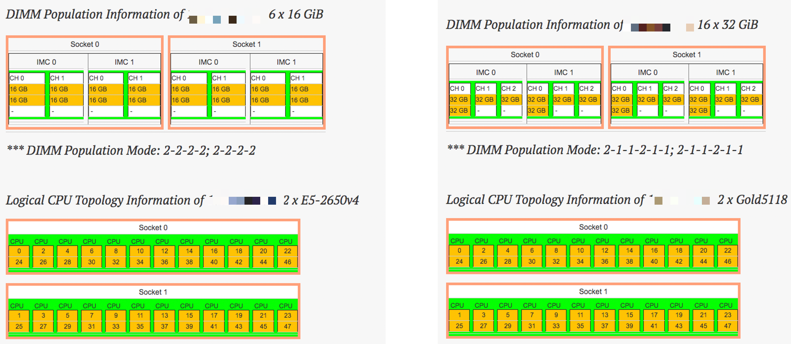

* L1 cache
  * L1D latency 是 4~5 个 cycles，算一下 load/store 指令占所有 instructions 的比例，小于 5 就没办法 hide latency，需要优化访存模式
* LLC (L3 cache)
  * 直接走 IMC，llc-load-miss * 64B per load / time elapsed，和内存带宽数据做对比

[Xeon Gold 5118 - Intel](https://en.wikichip.org/wiki/intel/xeon_gold/5118)

[14 nm lithography process](https://en.wikichip.org/wiki/14_nm_lithography_process)

[Skylake (server) - Microarchitectures - Intel](https://en.wikichip.org/wiki/intel/microarchitectures/skylake_(server))

[Mesh Interconnect Architecture - Intel](https://en.wikichip.org/wiki/intel/mesh_interconnect_architecture)

SMP (Symmetric Multiprocessing): cache的发展

Bus Snooping (1983)

* 缺点：scaling有问题

* Write-invalidate
* Write-update

The two most common mechanisms of ensuring coherency are *[snooping](https://en.wikipedia.org/wiki/Bus_sniffing)* and *[directory-based](https://en.wikipedia.org/wiki/Directory-based_cache_coherence)*, each having their own benefits and drawbacks.

* Snooping based protocols tend to be faster, if enough [bandwidth](https://en.wikipedia.org/wiki/Memory_bandwidth) is available, since all transactions are a request/response seen by all processors. The drawback is that snooping isn't scalable. Every request must be broadcast to all nodes in a system, meaning that as the system gets larger, the size of the (logical or physical) bus and the bandwidth it provides must grow.

* Directories, on the other hand, tend to have longer latencies (with a 3 hop request/forward/respond) but use much less bandwidth since messages are point to point and not broadcast. For this reason, many of the larger systems (>64 processors) use this type of cache coherence.

scalability of multi-thread applications can be limited by synchronization 

synchronization primitives: LOCK PREFIX、XCHG

Hyper-threading

https://www.semanticscholar.org/paper/Hyper-Threading-Technology-Architecture-and-1-and-Marr-Binns/04b58af4fc0e5c3e8e614e2ddb0c41749cc9166c

https://pdfs.semanticscholar.org/04b5/8af4fc0e5c3e8e614e2ddb0c41749cc9166c.pdf?_ga=2.24705338.1691629142.1553869518-295966427.1553869518

https://www.slideshare.net/am_sharifian/intel-hyper-threading-technology/1

* 实测性能是 -20% ~ +20%，因为可能依赖内存带宽、抢占cache。数值计算任务，用到了AVX、SSE技术的，开Hyper-threading一般都会降性能；访存频繁的CPU任务，建议打开，因为circle、LRU是idle的，会有提升
* 禁止hyper-threading：offline、isolate

内存拓扑的 unbalanced 问题

* 可能导致同一物理机上先启动的服务效率高
* 多 channel 的 64bit DRAM，ddr 频率在 2666 居多，单 channel 可以到 ～20GB/s，4～6 channel 比较常见

Some conclusion and Advices

* 11 -> 1H: Hyper Threading could help on performance on such “lock” condition (But may not in the end, maybe depends on the total threads: C1-> CH)

* 22->21: Lower Core-Count Topology helps for this circustances (Not the Benchmark Software threads)

* Increase of the hardware resource (along with a huge mount of OS threads) usually not help on the performance, but waste of the CPU and memory resources

* Intel’s “innovation” for high performance processors has been tired with maintaining the same performance for “unconstrained” end users.
  * Intel has been done very well, if you compare with ARM64 Enterprise and AMD...

* lock code is the RISK (pitfall from something beyond your source code, even from glibc, 3rd lib ...)

* Use the scaling tests to find your bottleneck, and improve the “lock”  componets
  * Maybe from DISK I/O, Network layer
  * Rarely from the memory bandwidth layer, LLC cache size for the non-HPC workloads