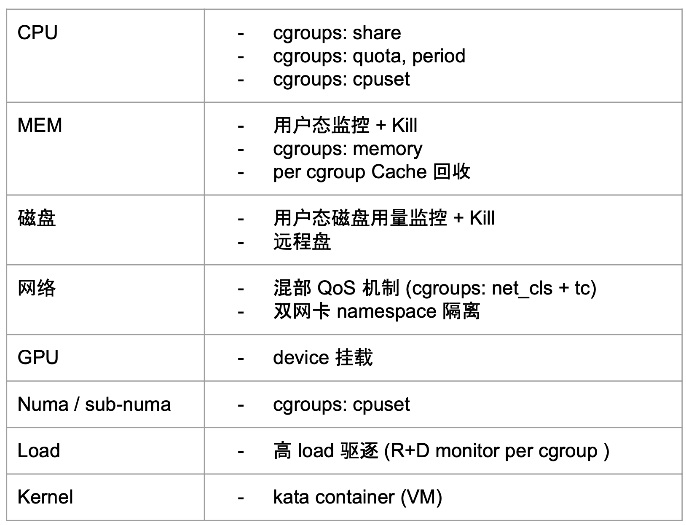

### Distributed Systems

**[l01-Introduction and MapReduce](https://github.com/huangrt01/CS-Notes/blob/master/Notes/Distributed-Systems/l01-Introduction%20and%20MapReduce)**

#### 《Apache Hadoop YARN: Yet Another Resource Negotiator》

[YARN官网](https://hadoop.apache.org/docs/stable/hadoop-yarn/hadoop-yarn-site/YARN.html)

[YARN 在字节跳动的优化与实践](https://mp.weixin.qq.com/s/9A0z0S9IthG6j8pZe6gCnw)

1.Abstract

解决两大问题：1）依赖特定编程模型 2）中心式管理难以scale

设计核心是 separating resource management func-tions from the programming model，更彻底地将 platform和framework抽象开

2.History

R1,R2: hadoop community

R3: HoD

R4,R5: HoD -> shared clusters

R6,R7: shared clusters

R8,R9,R10: Apache MapReduce的局限性 -> YARN

3.Architecture

RM是中心，也是连接AM和NM的桥梁

RM还能找AM要回资源

NM: container launch context (CLC)的概念，启动、监控、local service、auxiliary service

AM: late binding, the process spawned is not bound to the request, but to the lease.

fault tolerance: RM对AM有、AM责任最重

* YARN only secures its deployment
* RM单点故障，Work is in progress to add sufficient protocol sup-port for AMs to survive RM restart.
* 抽象分离的代价：更多fault tolerance工作交给了frameworks来设计

4.YARN in the real-world

compute resource，分布式计算资源池，跑spark、flink任务等

集群一般会配两个RM、成千上万个NM；多个RM之间用zk选主，同一时间只有一个在工作

e.g. 500000 jobs daily

一些concern：

* HDFS NameNode becomes the bottleneck
* YARN have been observed on a few large clusters with massive amounts of small applications, but recent improvements in heartbeat handling have mitigated some of these issues.

One of the most important architectural differences that partially explains these improvements is the removal of the static split between map and reduce slots.

6.Related Work

和MesOs等类似架构对比，YARN特点是multiple application frameworks、per-job intra-framework scheduler、资源管控、lazy binding等

和基于虚机的任务对比，YARN更适合运行时间短、切换更频繁的任务

理想调度算法

ideal scheduler: Multiple Knapsack Problem(MKP) (NP-C Problem)

经典生产调度算法1 - 吞吐型

* [YARN原生调度策略](https://hadoop.apache.org/docs/current/hadoop-yarn/hadoop-yarn-site/FairScheduler.html)

* with Quota/Priorities/DRF

  

经典生产调度算法1 - 全局视角
* 每次分配按规则对节点进行sort
* 问题1:吞吐效率问题？(scalable)
* 缓存节点排序结果(多次调度一次排序/ 抽样排序)
* 并发多个 {调度队列, 节点分区}（做hash、吞吐提升明显）
* 问题2:同一request内多个节点间的约束很难表达
  * 比如gang性、打散、集中、碎片最少等

[The evolution of cluster scheduler architectures](https://www.cl.cam.ac.uk/research/srg/netos/camsas/blog/2016-03-09-scheduler-architectures.html)

调度策略：队列

* 单集群内的物理节点被划分为多个 label
* Label 的资源总量在逻辑上被划分为多个队列
* 队列配置min/max值（允许一定的超用、max对用户隐藏）

调度策略：DRF

* 队列和应用都同时声明不止一个维度的资源 (eg. CPU, MEM)
* 在进行排序时, 如果只考虑一个维度, 可能导致其它维度碎片严重
* DRF(Dominant Resource Fairness) 将各个维度上已经使用的资源占其维度上的资 源总量的百分比中最大的值作为其主资源的代表, 各个队列、应用直接对主资源代表进行比较, 进而得到排序

=> req定制Node的弱约束、req内强/弱约束

资源隔离：物理隔离

方案一：将物理机分别划入不同的集群 

* 场景：
  * 离线&流式机器隔离 
  * 单集群过大拆分
* 优势：完整独立的故障域 
* 缺点：运维成本，需要搭建独立的RM及配置的监控报警

方案二：将物理机划入同个集群内的不同Label中 

* 场景：
  * 核心作业队列隔离
  * 跨POD物理机隔离
* 优势：共用相同RM
* 缺点：共享RM全局配置, 如单心跳分配container数量

资源隔离：共享物理机隔离

* AMD机器跨numa能力弱，因此划分subnuma

#### 《Mesos: A Platform for Fine-Grained Resource Sharing in the Data Center》

1.Introduction

across framework的shared cluster

two-level scheduling mechanism called resource offers. 

和YARN做对比：

* YARN的AM的“影响调度”的能力比Mesos弱，并不具备完全的"two-level scheduling"能力
* Mesos is an offer-based resource manager, whereas YARN has a request-based approach 感觉YARN在框架间对资源的分配会更灵活一些

3.Architecture

rejection mechanism

fault tolerance

* designed the master to be soft state, so that a new master can completely reconstruct its internal state from information held by the slaves and the framework schedulers.

4.Mesos Behavior

fragmentation: 碎片取决于 max_task_size/node_size，这也是为什么大家追求集群node数量的原因（YARN最多单集群5w nodes）

5.Implementation

hadoop port实现的local filesystem访问问题：

Hadoop normally writes map output files to the local filesystem, then serves these to reduce tasks using an HTTP server included in the Task-Tracker. However, the TaskTracker within Mesos runs as an executor, which may be terminated if it is not running tasks. This would make map output files unavailable to reduce tasks. We solved this problem by providing a shared file server on each node in the cluster to serve local files

6.Evaluation

overhead < 4%

#### 《Design patterns for container-based distributed systems》

https://skyscribe.github.io/post/2019/07/21/from-borg-to-kubernetes/

https://kubernetes.io/

single-container patterns for container management, single-node patterns of closely cooperating containers, and multi-node patterns for distributed algorithms

容器是更通用、更贴近底层的分布式抽象手段，是代码开发到生产环境更便捷的通路

容器之于分布式就是对象之于oop，只有用容器化这一抽象把系统和应用分离开，才能基于此做很多更复杂的优化（混布提升利用率、错峰潮汐、更精细的物理资源划分）

3.Single-container management patterns

从upward和downward两方面思考

* upward
* downward
  * scale up
  * For example, Kubernetes uses a “grace-ful deletion” feature of Docker that warns a container, via the SIGTERM signal, that it is going to be termi-nated, an application-defined amount of time before it is sent the SIGKILL signal.

4.Single-node, multi-container application patterns

4.1 Sidecar pattern

可利用 [cgroups](https://www.kernel.org/doc/Documentation/cgroup-v1/cgroups.txt)

4.2 Ambassador pattern

4.3 Adapter pattern

5.Multi-node application patterns

5.1 Leader election pattern

5.2 Work queue pattern

5.3 Scatter/gather pattern

6.Related Work

* Service-oriented architectures (SOA)

