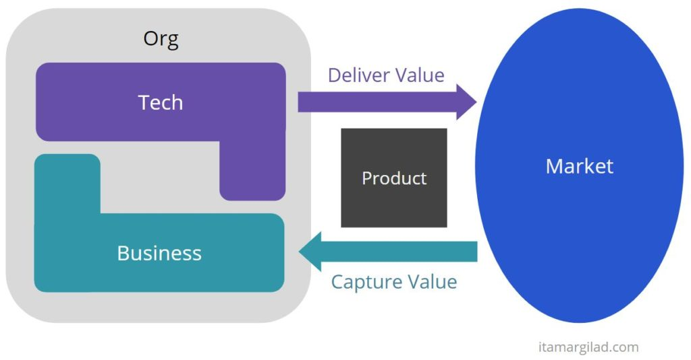

## 非技术知识

LT: Life Time 用户生命周期 

LTV: Life Time Value 用户生命价值

ARPU: Average Revenue Per User 用户日均收入（每个用户每个活跃日可以提供的平均收入）

LT * ARPU = LTV

DAU = MAU * (DAU/MAU) (用户活跃度)

QoS: Quality of Service

#### ROI
* 三个要素：
  * 计算主体（不是具象的客体，而是抽象的动作；问题颗粒度取决于想反馈的目标）
  * 计算媒介（关键变量）
  * 数学建模 
* 四个步骤：
  * 规划：业务洞察力，列举所有可能的成本和收益
  * 评估
  * 执行：变数->临时评估；评估要排除已经沉没的成本和收益
  * 复盘：反思结果和预判的差别；差别大 -> 调整主观预期、业务层面优化

* 持续策略收益评估：
  * 单次策略的重点是预评估，持续策略的重点是反馈机制
  * 考虑自主循环和时效性：动作饱和问题；切割收益和成本
  * 快速评估和优化机制设计
    * 媒介：投放->竞价, 红包策略->数值策略
    * 制定反馈机制
* 统计工具与模型
  * 数据调研和元假设：建模中内蕴的假设，来源于信念/历史经验。e.g. LSTM模型 => 数据集有时间结构或前后因果关系
  * 预估：
    * 数理统计：函数族拟合 => 模型容量不够；离散时间序列 (ARIMA、GARCH) => 参数矩阵奇异性、对outlier敏感
    * 统计学习：高维回归问题，GBDT->XGBT, HMM (自带时间结构、算力消耗大)
    * 深度学习：回归问题- MLP，时序性质- RNN。可解释性不强（核心思路是深度学习解决部分问题，再聚合结果）；启动成本问题
  * 增量计算：
    * A/B实验：开挂，不要过于依赖导致丧失自己的因果推断能力
      * A/B开不出来的场景：《囧妈》、疫情影响
    * 备选方案A/A：选取常态稳定的指标，比较粗糙
    * 伪A/B：挑选“相似人群”，难以评估，有一种方式是对行为向量序列降维，评估人群相似性
* 建模中的经典trick
  * “经验困境”：贝叶斯方法
  * 如何应对变化的外部环境：平滑化方法
    * 平滑工具：filter、pooling、正则项惩罚参数移动、贝叶斯化限制参数移动
    * 修正：根据上级维度的情况
  * 主观性问题中的非直接收益
    * 向外释放的媒介值通过混沌系统还回来
    * 方法：主观判断/问卷调研
  * 链式偏差问题和蒙特卡洛方法
    * 不要看点值，要看分布
* 提升因果逻辑分析能力
  * 解耦和节点化
  * “因果网络”
  * 敏感性分析：设置硬边界、设置先验概率、节点合理性、映射方式合理性
  * 非平衡代价问题

#### Problem Solving

真正的价值是问题分析后的 So-What

四个步骤
* 定义关键问题
  * 了解 context -> 准确识别“真正的需要解决的问题” -> 重新定义问题
  * Issue Tree 分解大问题，分解依赖 Hypothesis
  * 分解问题树时遵循 MECE 原则（Mutually Exclusive Collectively Exhaustive）
* 给出可执行、具体、有认知深度的建议
* 进行快速迭代
* 清晰有力地沟通传递建议
  * 回顾听众真正关心的问题
  * 把答案结构化
  * 为听众量身定制
  * 检查是否解决了听众的问题

#### 工程师成长的真相 by zhenyuan

* 技术专家的特点：技术、balance、合作、产品视野、方法论
* 捕鼠器的故事
* 技术和业务的 balance，需要靠 control 的部分来管理，有人（比如技术VP、某个架构组）来去协调，进行必要统一，并在这个过程中对部分工作进行认可。
* 大 和 高效 的矛盾
  * 假设被打破：1）互相了解细节；2）工作目标和评价容易和上级沟通
  * => 冗余组织、管理风险、单位人效下降
* 对 产品team 和 基础技术team 的思考
  * 产品team
    * rd 和 pm 都会有 credit
    * rd 需要足够人力支持探索——进而设计更多机制去支持（如果 rd 和 pm 的沟通完全平等，pm 会处于弱势）
  * 基础技术team
    * 明确客户是谁
    * 标准不够高：要考虑错误率的放大效应
    * 暴露过多细节（主动加强技术普及，增加信任度和相互理解）
* 建立信任、有效沟通、换位思考，是向上管理的基础
  * 信息、预期、理念一致

#### Potpourri

思维模型：

* 法律 & 程序（40%）：严谨、精确、无二义性，考虑很多案例，正反思考
* 历史 & 统计（30%）：趋势、数据统计，用以分析问题
* 经济 & 价值（30%）：实用性、价值判断，经济学原理是社会运作的原理

[Product-Led is Just as Bad as Sales-Driven](https://itamargilad.com/product-led/)

公司分类

* 人力成本高：重人效
* 资产成本高：重业务系统化（ERP, Enterprise resource planning）

#### Knowledge Sources

* Feed Site
  * Reddit/Programming: https://www.reddit.com/r/programming/
  * Hacker News: https://news.ycombinator.com/
  * Two Minutes Papers: https://www.youtube.com/c/K%C3%A1rolyZsolnai/videos
  * The Morning Paper: https://blog.acolyer.org/
  * Best Paper Awards in Computer Science: https://jeffhuang.com/best_paper_awards/
  * [Google Research](https://research.google/pubs/) and [Arxiv](https://arxiv.org/list/cs/recent)
  * [Microsoft Research](https://www.microsoft.com/en-us/research/search/?from=http%3A%2F%2Fresearch.microsoft.com%2Fapps%2Fcatalog%2Fdefault.aspx%3Ft%3Dpublications) and [Facebook Research](https://research.fb.com/publications/)
  * MIT's Distributed Systems Reading Group: http://dsrg.pdos.csail.mit.edu/
  * Papers We Love: https://github.com/papers-we-love/papers-we-love
  
* Engineer Blogs

  * Facebook Engineering (Recommended): https://engineering.fb.com/category/core-data/
  * 左耳朵耗子 Blog: https://coolshell.cn/, [付费专栏](https://time.geekbang.org/column/intro/48)
  * Cloudflare Blog: https://blog.cloudflare.com/
  * Netflix Blog: https://netflixtechblog.com/
  * Uber Engineering: https://eng.uber.com/
  * AWS CTO - All Things Distributed: https://www.allthingsdistributed.com/
  * AWS Blog: https://aws.amazon.com/cn/blogs/aws/
  * Microsoft - Cloud Design Pattern: https://docs.microsoft.com/en-us/azure/architecture/patterns/
  * High Scalability: http://highscalability.com/
  * RedHat Blog: https://www.redhat.com/en/blog
  * Splunk Blog: https://www.splunk.com/en_us/blog
  * Data Bricks Blog: https://databricks.com/blog/category/engineering
  * Martin Fowler: https://martinfowler.com
  * Hacker Noon: https://hackernoon.com/
  * Brendan D. Gregg: http://www.brendangregg.com/
#### Efficiency

* 作图
  * https://chrome.google.com/webstore/detail/diagramsnet-desktop/pebppomjfocnoigkeepgbmcifnnlndla/related
  * https://www.processon.com/
  * Google drawing

